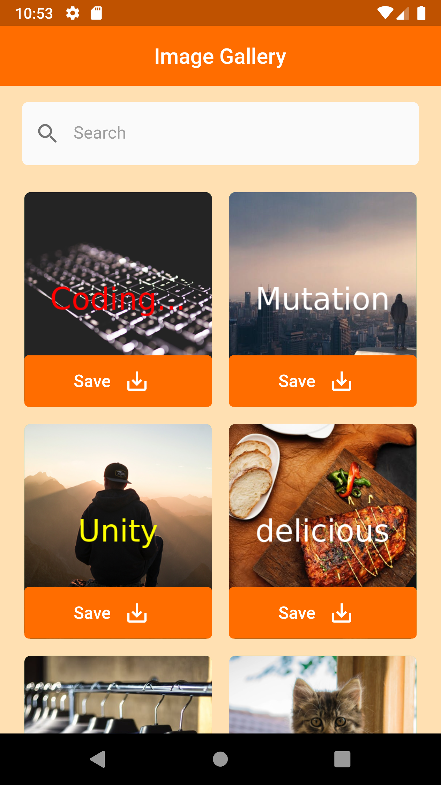

# Image APP

 
 

## Flutter project of search for image depend on :

Types : [ nature , people , fashion , food , animals , technology ]

Colors : text color red , green .... you can checkout the [Available Color](https://docs.temp.media/colors) 🌈

text : text in the center of image

the website [here](https://temp.media/) 📄

## Actions

- [x] Search Image
- [ ] Save image to the gallery

hope you like it
